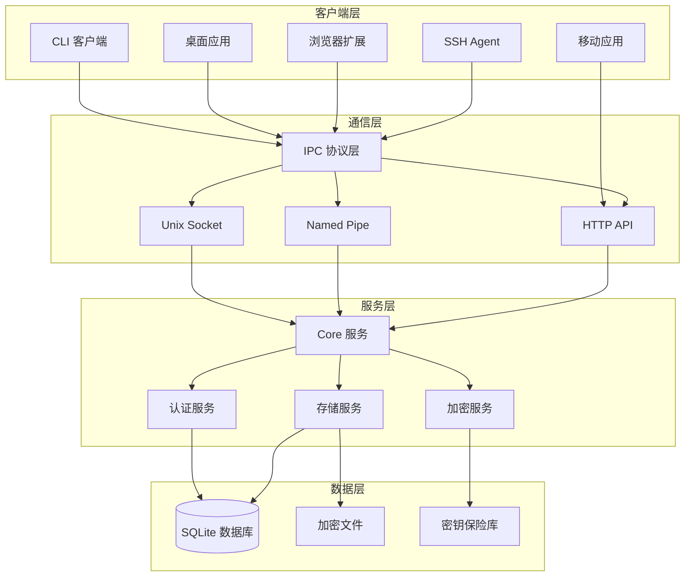

# 客户端通信架构

Persona 数字身份管理系统采用统一的客户端通信架构，所有客户端（CLI、桌面应用、浏览器扩展、SSH Agent）都通过标准化的IPC协议与本地服务进行通信。

## 架构概览



## 设计原则

### 1. 本地优先 (Local-First)

- **主要通信方式**: Unix Socket (macOS/Linux) / Named Pipe (Windows)
- **备用方案**: HTTP API (跨网络或移动设备)
- **数据主权**: 所有敏感数据本地存储和加密
- **离线能力**: 完整功能无需网络连接

### 2. 统一接口 (Unified Interface)

- **标准协议**: 所有客户端使用相同的IPC协议
- **类型安全**: 基于Rust类型的序列化/反序列化
- **版本兼容**: 协议版本化，向后兼容
- **错误处理**: 统一的错误响应格式

### 3. 安全优先 (Security-First)

- **端到端加密**: 客户端到服务端的加密通信
- **权限验证**: 基于会话的权限管理
- **审计日志**: 所有操作的完整审计记录
- **隔离**: 不同客户端的权限隔离

### 4. 性能优化 (Performance)

- **异步通信**: 非阻塞的异步操作
- **连接池**: 复用连接减少延迟
- **批量操作**: 支持批量请求和响应
- **缓存**: 智能缓存减少重复查询

## 通信协议层次

### 第1层：传输层 (Transport Layer)

#### Unix Domain Sockets (主要)
- **路径**: `~/.persona/persona.sock`
- **权限**: `0600` (仅所有者可访问)
- **特点**:
  - 零拷贝，最佳性能
  - 操作系统级别的安全隔离
  - 自动清理（进程终止时）

#### Named Pipes (Windows)
- **路径**: `\\.\pipe\persona-{user-id}`
- **权限**: 用户专有访问
- **特点**:
  - Windows原生IPC机制
  - 与Unix Socket API兼容
  - 支持异步操作

#### HTTP/WebSocket (备用)
- **端口**: `127.0.0.1:8080` (默认)
- **协议**: HTTP/1.1 + WebSocket
- **特点**:
  - 跨网络访问
  - 移动应用支持
  - 标准Web技术栈

### 第2层：序列化层 (Serialization Layer)

#### 消息格式
```rust
#[derive(Serialize, Deserialize)]
pub struct IpcMessage {
    pub id: String,           // 请求ID
    pub version: String,      // 协议版本
    pub method: String,       // 方法名
    pub params: Value,        // 参数
    pub timestamp: i64,       // 时间戳
}

#[derive(Serialize, Deserialize)]
pub struct IpcResponse {
    pub id: String,           // 对应请求ID
    pub result: Option<Value>,// 成功结果
    pub error: Option<IpcError>, // 错误信息
    pub timestamp: i64,       // 时间戳
}
```

#### 序列化协议
- **主要格式**: MessagePack (二进制，紧凑)
- **备用格式**: JSON (文本，调试友好)
- **压缩**: 可选的LZ4压缩

### 第3层：RPC层 (RPC Layer)

#### 方法调用模式
```rust
// 同步调用
let identity = client.call("identity.get", params).await?;

// 异步通知
client.notify("auth.logout", params).await?;

// 订阅事件
let stream = client.subscribe("events.audit_log").await?;
```

#### 标准方法命名
- **身份管理**: `identity.{create|read|update|delete|list|switch}`
- **凭证管理**: `credential.{create|read|update|delete|list|search}`
- **认证操作**: `auth.{login|logout|verify|refresh}`
- **配置管理**: `config.{get|set|reset}`
- **审计日志**: `audit.{query|stream}`
- **系统操作**: `system.{status|version|shutdown}`

## 客户端实现

### CLI 客户端

#### 特点
- **同步接口**: 阻塞调用，适合脚本使用
- **批量模式**: 支持批量操作
- **输出格式**: 多种输出格式 (JSON, YAML, Table)

#### 实现示例
```rust
pub struct CliClient {
    transport: UnixTransport,
    session: Option<SessionId>,
}

impl CliClient {
    pub async fn connect() -> Result<Self> {
        let transport = UnixTransport::connect("~/.persona/persona.sock").await?;
        Ok(Self { transport, session: None })
    }

    pub async fn login(&mut self, password: &str) -> Result<()> {
        let response = self.call("auth.login", json!({
            "password": password
        })).await?;

        self.session = Some(response["session_id"].as_str().unwrap().into());
        Ok(())
    }
}
```

### 桌面应用 (Tauri)

#### 特点
- **事件驱动**: 基于事件的响应式界面
- **实时更新**: WebSocket订阅实时数据
- **富界面**: 完整的图形用户界面

#### 实现示例
```rust
// Tauri 命令
#[tauri::command]
async fn get_identities() -> Result<Vec<Identity>, String> {
    let client = get_client().await?;
    client.call("identity.list", json!({}))
        .await
        .map_err(|e| e.to_string())
}

// 前端 (React/TypeScript)
import { invoke } from '@tauri-apps/api/tauri';

const identities = await invoke('get_identities');
```

### 浏览器扩展

#### 特点
- **跨域通信**: 通过Native Messaging与本地服务通信
- **安全隔离**: 扩展沙箱环境
- **自动填充**: DOM操作和表单填充

#### 通信流程
```
浏览器扩展 -> Native Host -> Unix Socket -> Core Service
     |              |              |            |
   Content      Background      IPC Client   Business
   Script        Script         Proxy         Logic
```

#### 实现示例
```javascript
// 扩展侧
chrome.runtime.sendNativeMessage('com.persona.native', {
    method: 'credential.search',
    params: { domain: 'github.com' }
}, response => {
    if (response.result) {
        fillCredentials(response.result);
    }
});
```

### SSH Agent

#### 特点
- **标准协议**: 实现OpenSSH Agent协议
- **双向通信**: SSH Agent Protocol + Persona IPC
- **策略控制**: 基于策略的签名控制

#### 通信模式
```
SSH Client -> SSH Agent -> Core Service
     |           |             |
   SSH Protocol  Persona IPC  Database
   (标准)        (自定义)      (SQLite)
```

## 服务端架构

### Core Service

#### 主要组件
```rust
pub struct PersonaService {
    pub auth: AuthService,
    pub identity: IdentityService,
    pub credential: CredentialService,
    pub audit: AuditService,
    pub config: ConfigService,
}
```

#### 启动流程
```rust
#[tokio::main]
async fn main() -> Result<()> {
    // 1. 初始化服务
    let service = PersonaService::new().await?;

    // 2. 启动IPC服务器
    let ipc_server = IpcServer::new(service.clone());
    let unix_listener = UnixListener::bind("~/.persona/persona.sock")?;

    // 3. 启动HTTP服务器 (可选)
    let http_server = HttpServer::new(service.clone());
    let http_listener = TcpListener::bind("127.0.0.1:8080")?;

    // 4. 并发处理连接
    tokio::try_join!(
        ipc_server.serve(unix_listener),
        http_server.serve(http_listener),
    )?;

    Ok(())
}
```

### 会话管理

#### 会话生命周期
```rust
pub struct Session {
    pub id: SessionId,
    pub user_id: UserId,
    pub created_at: DateTime<Utc>,
    pub last_activity: DateTime<Utc>,
    pub permissions: HashSet<Permission>,
    pub is_active: bool,
}

impl Session {
    // 认证检查
    pub fn requires_auth(&self, operation: &Operation) -> bool {
        match operation {
            Operation::IdentityList => self.has_permission(Permission::IdentityRead),
            Operation::CredentialCreate => self.has_permission(Permission::CredentialWrite),
            _ => false
        }
    }
}
```

## 错误处理

### 统一错误格式

#### 错误类型
```rust
#[derive(Serialize, Deserialize, Debug)]
pub struct IpcError {
    pub code: ErrorCode,
    pub message: String,
    pub details: Option<Value>,
    pub trace_id: String,
}

#[derive(Serialize, Deserialize, Debug)]
pub enum ErrorCode {
    // 认证错误
    AuthenticationRequired,
    AuthenticationFailed,
    SessionExpired,

    // 授权错误
    PermissionDenied,
    InsufficientPrivileges,

    // 业务逻辑错误
    ResourceNotFound,
    InvalidInput,
    ConflictingOperation,

    // 系统错误
    InternalError,
    ServiceUnavailable,
    DatabaseError,
}
```

#### 错误响应示例
```json
{
    "id": "req-123",
    "error": {
        "code": "AuthenticationRequired",
        "message": "Valid session required for this operation",
        "details": {
            "operation": "credential.create",
            "required_permission": "credential:write"
        },
        "trace_id": "trace-456"
    },
    "timestamp": 1640995200
}
```

## 性能优化策略

### 1. 连接管理

#### 连接池
```rust
pub struct ConnectionPool {
    pool: Arc<Mutex<Vec<Connection>>>,
    max_size: usize,
    idle_timeout: Duration,
}

impl ConnectionPool {
    pub async fn get_connection(&self) -> Result<Connection> {
        // 复用空闲连接或创建新连接
    }

    pub async fn return_connection(&self, conn: Connection) {
        // 返回连接到池中
    }
}
```

### 2. 批量操作

#### 批量请求格式
```rust
#[derive(Serialize, Deserialize)]
pub struct BatchRequest {
    pub requests: Vec<IpcMessage>,
    pub atomic: bool,  // 是否原子操作
}

#[derive(Serialize, Deserialize)]
pub struct BatchResponse {
    pub responses: Vec<IpcResponse>,
    pub success_count: usize,
    pub error_count: usize,
}
```

### 3. 缓存策略

#### 多级缓存
```rust
pub struct CacheLayer {
    // L1: 内存缓存 (最快)
    memory_cache: Arc<RwLock<LruCache<String, Value>>>,

    // L2: 本地存储 (中等)
    disk_cache: Arc<DiskCache>,

    // L3: 数据库 (最慢但权威)
    database: Arc<Database>,
}
```

## 安全考虑

### 1. 传输安全

#### Unix Socket权限
```bash
# socket文件权限
chmod 600 ~/.persona/persona.sock

# 目录权限
chmod 700 ~/.persona
```

#### Named Pipe安全 (Windows)
```rust
use windows::Win32::Storage::FileSystem::*;

let pipe = CreateNamedPipeW(
    pipe_name,
    PIPE_ACCESS_DUPLEX,
    PIPE_TYPE_MESSAGE | PIPE_READMODE_MESSAGE,
    1,
    BUFFER_SIZE,
    BUFFER_SIZE,
    0,
    &security_attributes, // 限制为当前用户
)?;
```

### 2. 认证和授权

#### JWT会话令牌
```rust
#[derive(Serialize, Deserialize)]
pub struct SessionToken {
    pub sub: UserId,      // 用户ID
    pub iat: i64,         // 签发时间
    pub exp: i64,         // 过期时间
    pub permissions: Vec<Permission>,
}

impl SessionToken {
    pub fn verify(&self, secret: &[u8]) -> Result<bool> {
        // 验证签名和有效期
    }
}
```

### 3. 审计日志

#### 通信审计
```rust
pub struct CommunicationAudit {
    pub session_id: SessionId,
    pub method: String,
    pub client_type: ClientType,
    pub timestamp: DateTime<Utc>,
    pub success: bool,
    pub error_code: Option<ErrorCode>,
}
```

## 开发和调试

### 1. 协议测试

#### 单元测试
```rust
#[tokio::test]
async fn test_identity_create() {
    let mut client = TestClient::new().await;

    let response = client.call("identity.create", json!({
        "name": "Test User",
        "email": "test@example.com"
    })).await?;

    assert!(response["result"]["id"].is_string());
}
```

#### 集成测试
```rust
#[tokio::test]
async fn test_end_to_end_flow() {
    // 启动测试服务
    let service = TestService::start().await;

    // 测试完整流程
    let client = CliClient::connect().await?;
    client.login("test-password").await?;

    let identity = client.create_identity("Test", "test@example.com").await?;
    let credential = client.create_credential(&identity.id, "password", "secret").await?;

    // 验证结果
    assert_eq!(identity.name, "Test");
    assert_eq!(credential.type_, "password");
}
```

### 2. 调试工具

#### IPC监控器
```bash
# 监控所有IPC通信
persona-debug monitor --socket ~/.persona/persona.sock

# 输出格式
# [2024-01-01T12:00:00Z] CLIENT->SERVER: identity.list {}
# [2024-01-01T12:00:01Z] SERVER->CLIENT: {result: [{id: "...", name: "..."}]}
```

#### 协议分析器
```bash
# 分析协议消息
persona-debug analyze --file ipc-trace.log

# 统计信息
# Total requests: 1234
# Success rate: 98.5%
# Average latency: 12ms
# Top methods: identity.list (45%), credential.search (32%)
```

## 部署配置

### 1. 系统服务配置

#### systemd (Linux)
```ini
[Unit]
Description=Persona Core Service
After=network.target

[Service]
Type=notify
User=%i
ExecStart=/usr/local/bin/persona-service
Restart=always
RestartSec=10
Environment=PERSONA_CONFIG_PATH=%h/.persona/config.toml

[Install]
WantedBy=multi-user.target
```

#### launchd (macOS)
```xml
<?xml version="1.0" encoding="UTF-8"?>
<!DOCTYPE plist PUBLIC "-//Apple//DTD PLIST 1.0//EN"
    "http://www.apple.com/DTDs/PropertyList-1.0.dtd">
<plist version="1.0">
<dict>
    <key>Label</key>
    <string>com.persona.service</string>
    <key>ProgramArguments</key>
    <array>
        <string>/usr/local/bin/persona-service</string>
    </array>
    <key>RunAtLoad</key>
    <true/>
    <key>KeepAlive</key>
    <true/>
</dict>
</plist>
```

### 2. 配置文件

#### 服务配置 (`service.toml`)
```toml
[server]
# Unix socket路径
unix_socket_path = "~/.persona/persona.sock"
# Named pipe名称 (Windows)
named_pipe_name = "persona-{user-id}"
# HTTP绑定地址 (可选)
http_bind = "127.0.0.1:8080"

[security]
# 会话超时时间 (秒)
session_timeout = 3600
# 最大并发连接数
max_connections = 100
# 启用TLS (HTTP模式)
enable_tls = false

[performance]
# 连接池大小
connection_pool_size = 10
# 批量操作最大大小
max_batch_size = 100
# 缓存大小 (MB)
cache_size_mb = 128

[logging]
# 日志级别
level = "info"
# 启用IPC通信日志
log_ipc = false
# 日志文件路径
file_path = "~/.persona/logs/service.log"
```

## 扩展性

### 1. 插件系统

#### 插件接口
```rust
pub trait PersonaPlugin: Send + Sync {
    fn name(&self) -> &str;
    fn version(&self) -> &str;

    // 注册RPC方法
    fn register_methods(&self, registry: &mut MethodRegistry);

    // 插件初始化
    async fn initialize(&self, context: &PluginContext) -> Result<()>;

    // 插件清理
    async fn cleanup(&self) -> Result<()>;
}
```

#### 动态加载
```rust
pub struct PluginManager {
    plugins: Vec<Box<dyn PersonaPlugin>>,
    registry: MethodRegistry,
}

impl PluginManager {
    pub async fn load_plugin(&mut self, path: &Path) -> Result<()> {
        // 动态加载插件库
        let lib = unsafe { libloading::Library::new(path)? };
        let constructor: Symbol<fn() -> Box<dyn PersonaPlugin>> =
            unsafe { lib.get(b"create_plugin")? };

        let plugin = constructor();
        plugin.register_methods(&mut self.registry);
        plugin.initialize(&self.context).await?;

        self.plugins.push(plugin);
        Ok(())
    }
}
```

### 2. 第三方集成

#### 外部服务连接器
```rust
pub trait ExternalConnector: Send + Sync {
    async fn authenticate(&self, credentials: &Credentials) -> Result<Session>;
    async fn sync_identities(&self, identities: &[Identity]) -> Result<()>;
    async fn import_credentials(&self) -> Result<Vec<Credential>>;
}

// 示例：1Password连接器
pub struct OnePasswordConnector {
    api_token: String,
    vault_id: String,
}

impl ExternalConnector for OnePasswordConnector {
    async fn import_credentials(&self) -> Result<Vec<Credential>> {
        // 从1Password导入凭证
    }
}
```

## 监控和指标

### 1. 性能指标

#### 关键指标
- **连接数**: 当前活跃连接数
- **请求延迟**: 95th/99th百分位延迟
- **吞吐量**: 每秒请求数 (RPS)
- **错误率**: 错误请求百分比
- **内存使用**: 服务内存占用
- **数据库性能**: 查询执行时间

#### 指标采集
```rust
use prometheus::{Histogram, Counter, Gauge};

lazy_static! {
    static ref REQUEST_DURATION: Histogram = Histogram::with_opts(
        HistogramOpts::new("ipc_request_duration_seconds", "IPC request duration")
    ).unwrap();

    static ref ACTIVE_CONNECTIONS: Gauge = Gauge::with_opts(
        GaugeOpts::new("ipc_active_connections", "Active IPC connections")
    ).unwrap();

    static ref REQUEST_TOTAL: Counter = Counter::with_opts(
        CounterOpts::new("ipc_requests_total", "Total IPC requests")
    ).unwrap();
}
```

### 2. 健康检查

#### 健康检查端点
```rust
pub struct HealthChecker {
    database: Arc<Database>,
    service: Arc<PersonaService>,
}

impl HealthChecker {
    pub async fn check_health(&self) -> HealthStatus {
        let mut status = HealthStatus::new();

        // 数据库连接检查
        status.database = self.check_database().await;

        // 服务状态检查
        status.service = self.check_service().await;

        // 磁盘空间检查
        status.disk_space = self.check_disk_space().await;

        status
    }
}
```

## 总结

Persona的客户端通信架构采用了现代化的设计模式：

1. **统一的IPC协议** - 所有客户端使用相同的通信标准
2. **多层传输支持** - Unix Socket/Named Pipe为主，HTTP为辅
3. **安全优先设计** - 端到端加密，权限隔离，完整审计
4. **高性能优化** - 异步处理，连接池，智能缓存
5. **开发友好** - 类型安全，错误处理，调试工具
6. **可扩展架构** - 插件系统，第三方集成，监控指标

这个架构为Persona提供了坚实的通信基础，支持从简单的CLI操作到复杂的桌面应用的各种使用场景，同时确保了安全性、性能和可维护性。

## 参考资料

- [IPC协议详细文档](./IPC_PROTOCOL.md)
- [Unix Domain Sockets编程指南](https://man7.org/linux/man-pages/man7/unix.7.html)
- [Windows Named Pipes文档](https://docs.microsoft.com/en-us/windows/win32/ipc/named-pipes)
- [MessagePack序列化格式](https://msgpack.org/)
- [Tauri IPC文档](https://tauri.app/v1/guides/features/command)

---

**维护者**: Persona 架构团队
**最后更新**: 2024-01-24
**版本**: v1.0