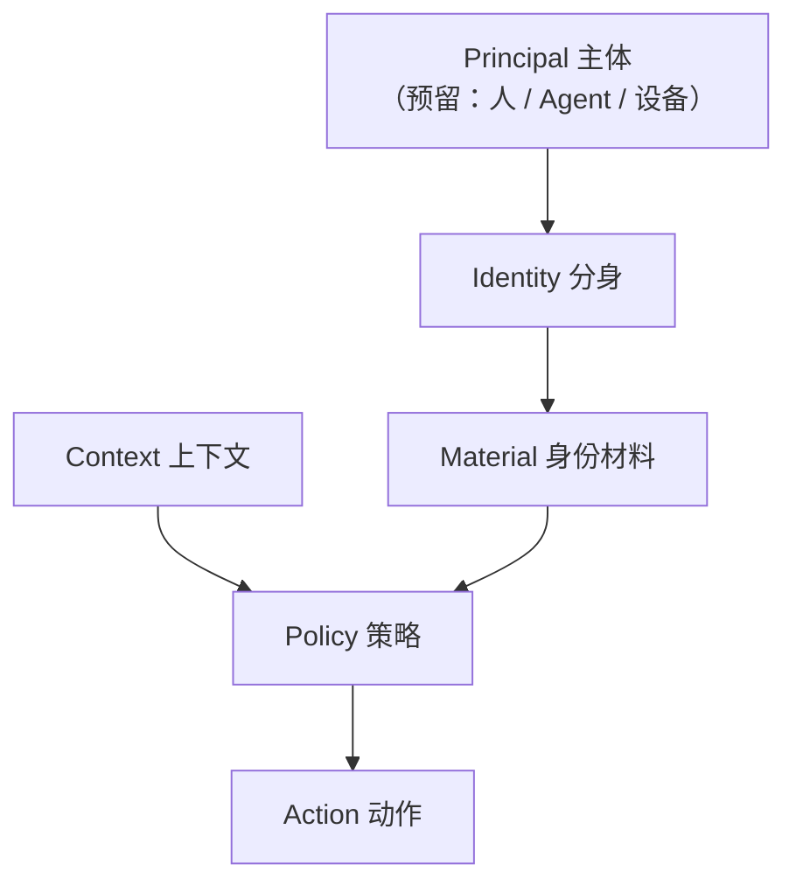

# 核心概念

Persona 围绕六个一级概念组织：**Identity（分身）、Context（上下文）、Material（身份材料）、Policy（策略）、Action（动作）**，以及预留的 **Principal（主体）**。它们共同回答一个问题：

> 一个人（或一个 Agent、一台设备）在某个数字环境中，以哪个身份、持有哪些身份材料、通过什么策略、执行什么动作？

- [**Principal（主体）**](./principal)：发起者——人、AI Agent 或设备的抽象（预留方向，尚未实现）。
- [**Identity（分身）**](./identity)：同一个人的不同数字身份，是身份材料的**组织与切换单位**。
- [**Context（上下文）**](./context)：客户端**可观察到**的环境事实（域名、主机、目录、设备…），用于建议与策略判断。
- [**Material（身份材料）**](./material)：密码、SSH 密钥、API key、TOTP、钱包、通行密钥。
- [**Policy（策略）**](./policy)：决定「谁、在什么上下文、对哪个材料的哪个动作」被放行的规则集合。
- [**Action（动作）**](./action)：作用于某个材料的具体操作——reveal、copy、fill、TOTP、generate、sign、save。

## 为什么必须把这六个概念分开

- **Identity ≠ Material**：工作分身的 GitHub 密码、GitHub SSH key、GitHub API key 是三份独立材料，归属同一个分身。迁移、轮换、分享的是材料，不是分身。
- **Material ≠ Action**：SSH key 本身没有权限，「sign」才是权限动作。客户端/浏览器扩展不直接持有明文，只请求一个经过策略检查的 Action。
- **Context ≠ 用户声明**：上下文是观察得到的事实（页面域名、本机 host、目录），不是用户拍脑袋选的模式——所以它能做**建议**，而不是**声明**。
- **Policy 不是安全细节**：它是所有敏感 Action 的统一裁决入口，与材料模型平级，而不是加密文档里的一个章节。

## 现状与规划（诚实边界）

| 概念     | 现状                             | 主要落点                                                                 |
| -------- | -------------------------------- | ------------------------------------------------------------------------ |
| Identity | ✅ 已实现                        | `identities` 表 + active 指针（见[用户手册：身份](/user/identity)）       |
| Material | ✅ 已实现                        | credentials / crypto_wallets / passkeys 表（见[身份材料](./material)）   |
| Policy   | 🟡 已实现为安全硬门槛，部分可配置 | origin binding、user gesture、SSH 策略、审批闸门（见[策略](./policy)）    |
| Action   | 🟡 协议层已分离                  | bridge 请求类型 + 授权闸门（见[动作](./action)）                          |
| Context  | 🟡 部分机制已落地                | origin binding、按身份过滤、站点默认值（见[上下文](./context)）           |
| Principal| ⬜ 预留，未实现                  | 方向见[主体](./principal)                                                 |

> 「已实现」指代码里存在并可测试；「部分落地」指机制存在但未抽象成一级模型，
> 或只有部分入口使用；「预留」指设计方向，不含实现承诺。

## 为什么这不是又一个密码管理器

密码管理器把世界建模成「一个 Vault，里面是条目」。Persona 把世界建模成：

- 谁（Principal，含未来的 Agent）持有哪个**分身**（Identity）；
- 分身下有哪些**材料**（Material）——密码只是其中一种；
- 什么**上下文**（Context）下、按什么**策略**（Policy）、允许哪些**动作**（Action）。

因此 Password、SSH、TOTP、Wallet、Passkey、浏览器填充都不是功能清单，而是
同一个模型下的材料与动作。1Password/Bitwarden 的能力是**功能基准**
（Persona 的开发者特性以此为对标），但产品的身份叙事不是「又一个密码管理器」。