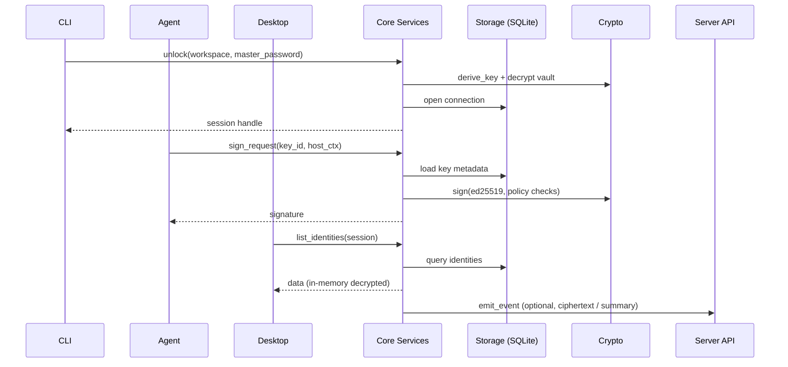

# 整体架构

## 分层设计

| 层 | 子模块 | 说明 |
| --- | --- | --- |
| 表现层 | CLI、Desktop、SSH Agent、未来移动端 | 负责交互体验、命令路由、通知等；不直接触达明文数据，只通过核心服务调用 |
| 核心领域层 | `core::services::{identity, credential, agent, wallet}` | 承载领域模型、验证、策略（如 SSH 签名确认、密码生成规则） |
| 安全与加密层 | `core::crypto` (Argon2id、AES‑GCM、ed25519) | 统一密钥派生、密文封装、密钥封存策略，确保 server/客户端一致 |
| 数据与存储层 | `core::storage` (`sqlx` + SQLite) | Workspace v2 schema、迁移、附件存储、审计日志 |
| 可选服务层 | `server` (Axum) | 审计事件、自动化 API、未来的同步冲突解决 |

## 模块交互

## 数据存储

- **Workspace DB**：SQLite 文件，记录身份、凭据、SSH 密钥、设置等。通过 `sqlx::migrate!` 管理 schema，默认位于 `~/.persona/workspaces/<id>/persona.db`。
- **Vault 文件**：存放包裹后的主密钥、随机盐、配置；必须使用 Argon2id + AES‑GCM 解密。
- **附件存储**：二进制 blobs（未来），以内容哈希命名，引用记录在 DB。
- **审计日志**：结构化 JSONL，记录 CRUD、签名、登录等操作，默认在 workspace `audit.log`。

## 扩展点

- **服务端事件**：核心通过 `core::events::Emitter` 抽象写入本地或远端（Axum server、WebHook），支持批量与重试。
- **策略插件**：SSH Agent 提供策略 trait，可扩展 biometrics、known_hosts 全量校验、审批工作流。
- **同步**：未来 server 将通过“密文 blob + 元数据”接口同步，客户端只需实现冲突解决策略即可。

此设计让 Persona 可以在“纯离线”的情况下工作，同时为未来的 server/sync、移动端和浏览器扩展保留清晰接口。
