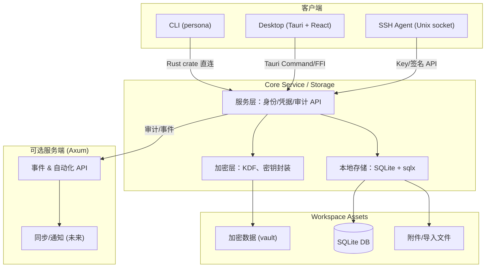

# 技术架构

Persona 采用“加密核心 + 多入口客户端 + 可选服务端”的分层架构，所有敏感操作都由本地 Rust 核心库完成。CLI、桌面端、SSH Agent 共享同一套模型/服务/存储，最大化复用能力，同时保留为未来 server/sync 扩展的接口。

## 架构总览

## 组件职责

- **Core (Rust)**：入口统一的领域服务，负责身份、凭据、SSH 密钥、钱包等模型；封装加解密策略、密钥派生 (Argon2id) 与签名操作；提供审计事件钩子。
- **Storage**：通过 sqlx 访问 SQLite（Workspace v2），统一迁移机制，附带附件/导入文件存储接口。
- **CLI**：命令行入口，直接依赖 core crate，负责工作区初始化、解锁、交互式输入以及自动化脚本场景。
- **Desktop**：Tauri shell 暴露 Rust 命令给 React UI，重用核心解锁逻辑；负责 UI 状态、通知、快捷操作。
- **SSH Agent**：长期驻留进程，通过 Unix socket 暴露 OpenSSH Agent 协议。所有密钥加载/签名都回调 core 服务，继承统一策略、日志与速率限制。
- **Server（可选）**：Axum + sqlx，负责事件收集、自动化 API、未来的端到端加密同步。Server 只接触密文或事件摘要，不会解密用户数据。

## 数据流与安全机制

1. **解锁**：CLI/桌面/Agent 请求核心解锁；核心使用 Argon2id 将主密码派生成密钥，解密工作区 vault，并缓存短期 session key。
2. **业务操作**：客户端通过核心服务层执行身份/凭据/密钥 CRUD。所有写入在本地完成，并同步写入审计日志。
3. **SSH 签名**：Agent 接收 `sign_request`，核心检查策略（确认、人机验证、频率限制、known_hosts），然后用内存中的私钥执行签名。
4. **可选事件上报**：审计事件可以串行写入本地日志，也可以通过 `core::events` 模块推送到 server，供同步或自动化使用。

此架构让 Persona 在“本地优先 + 零知识”的前提下保持高度模块化：客户端新增功能只需调用核心服务；服务端扩展不会接触明文；SSH Agent 与桌面端共享加密与存储实现，降低维护成本。
